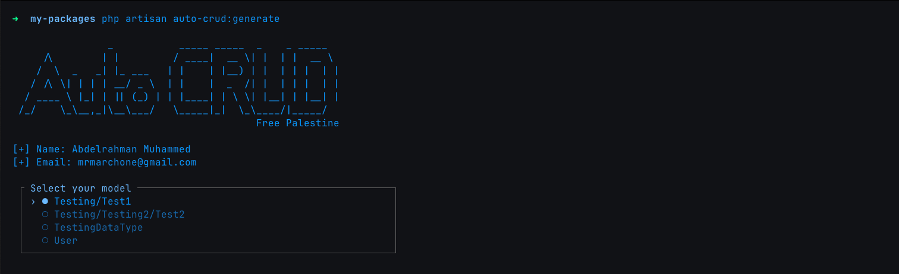

# Laravel Auto CRUD Generator


Laravel Auto CRUD Generator is a package that simplifies CRUD (Create, Read, Update, Delete) operations for your Laravel application. With a single command, you can generate all necessary files and logic for a selected model, reducing development time and effort.

[Watch the Video on YouTube](https://www.youtube.com/watch?v=6IqRc3OgUIM)

## Features
- Automatically detects models in the app/Models folder.
- Provides an interactive CLI to select a model.
- Generates controller, request validation, routes, views, and more.
- Follows Laravel's best practices for clean and maintainable code.

## Installation

You can install the package via Composer:

```bash
composer require mrmarchone/laravel-auto-crud --dev
```

## Publish Configuration

You can publish the configuration file via:

```bash
php artisan vendor:publish --provider="Mrmarchone\LaravelAutoCrud\LaravelAutoCrudServiceProvider" --tag="auto-crud-config"
```


## Usage

To generate CRUD operations for a model, use the following Artisan command:

```bash
php artisan auto-crud:generate -h
```

```textmate
Description:
  A command to create auto CRUD for your models.

Usage:
  auto-crud:generate [options]

Options:
  -A, --all                       Force generate all possible files without overwrite option.
  -M, --model[=MODEL]             Select one or more of your models. (multiple values allowed)
  -T, --type[=TYPE]               Select weather api, web or both. (multiple values allowed)
  -R, --repository                Working with repository design pattern.
  -O, --overwrite                 Overwrite the files if already exists.
  -P, --pattern[=PATTERN]         Supports Spatie-Data Pattern. [default: "normal"]
  -C, --curl                      Generate CURL Requests for API.
  -S, --swagger-api               Generate Swagger API json for API.
  -h, --help                      Display help for the given command. When no command is given display help for the list command
      --silent                    Do not output any message
  -q, --quiet                     Only errors are displayed. All other output is suppressed
  -V, --version                   Display this application version
      --ansi|--no-ansi            Force (or disable --no-ansi) ANSI output
  -n, --no-interaction            Do not ask any interactive question
      --env[=ENV]                 The environment the command should run under
  -FA, --force-all                Force generate all possible files with overwrite option.
  -MP, --model-path[=MODEL-PATH]  Set models path.
  -PM, --postman                  Generate Postman Collection for API.
  -v|vv|vvv, --verbose            Increase the verbosity of messages: 1 for normal output, 2 for more verbose output and 3 for debug
```

> ⚠️ **Warning**  
> Take care when you create a models outside app directory, because command will generate the folder structure in all folders like Controllers, Resources, Requests, etc.  
> Example (Models Path) => AnotherModels/Models , this will generate files like this one app/Http/Controllers/AnotherModels/Models/ModelController.php

### Example:

```bash
php artisan auto-crud:generate --model-path=app/AnotherModels --model=User --model=Manager --overwrite --type=api --repository --pattern=spatie-data --curl --postman
```



This will generate:
- API Controller:
```php
<?php

namespace App\Http\Controllers\API;

use App\Http\Controllers\Controller;
use App\Http\Requests\UserRequest;
use App\Http\Resources\UserResource;
use App\Models\User;
use Illuminate\Http\Request;
use Symfony\Component\HttpFoundation\Response;

class UserController extends Controller
{
    public function index(): \Illuminate\Http\Resources\Json\AnonymousResourceCollection
    {
        return UserResource::collection(User::latest()->paginate(10));
    }

    public function store(UserRequest $request): UserResource|\Illuminate\Http\JsonResponse
    {
        try {
            $user = User::create($request->validated());
            return new UserResource($user);
        } catch (\Exception $exception) {
            report($exception);
            return response()->json(['error' => 'There is an error.'], Response::HTTP_INTERNAL_SERVER_ERROR);
        }
    }

    public function show(User $user): UserResource
    {
        return UserResource::make($user);
    }

    public function update(UserRequest $request, User $user): UserResource|\Illuminate\Http\JsonResponse
    {
        try {
            $user->update($request->validated());
            return new UserResource($user);
        } catch (\Exception $exception) {
            report($exception);
            return response()->json(['error' => 'There is an error.'], Response::HTTP_INTERNAL_SERVER_ERROR);
        }
    }

    public function destroy(User $user): \Illuminate\Http\JsonResponse
    {
        try {
            $user->delete();
            return response()->json(['message' => 'Deleted successfully'], Response::HTTP_NO_CONTENT);
        } catch (\Exception $exception) {
            report($exception);
            return response()->json(['error' => 'There is an error.'], Response::HTTP_INTERNAL_SERVER_ERROR);
        }
    }
}
```
- API Controller with Spatie Data (if applicable):
```php
<?php

namespace App\Http\Controllers\API;

use App\Http\Controllers\Controller;
use App\Data\UserData;
use App\Models\User;
use Symfony\Component\HttpFoundation\Response;

class UserController extends Controller
{
    public function index(): array|\Illuminate\Contracts\Pagination\CursorPaginator|\Illuminate\Contracts\Pagination\Paginator|\Illuminate\Pagination\AbstractCursorPaginator|\Illuminate\Pagination\AbstractPaginator|\Illuminate\Support\Collection|\Illuminate\Support\Enumerable|\Illuminate\Support\LazyCollection|\Spatie\LaravelData\CursorPaginatedDataCollection|\Spatie\LaravelData\DataCollection|\Spatie\LaravelData\PaginatedDataCollection
    {
        return UserData::collect(User::latest()->paginate(10));
    }

    public function store(UserData $data): UserData|\Illuminate\Http\JsonResponse
    {
        try {
            $user = User::create($data->all());
            return new UserData($user);
        } catch (\Exception $exception) {
            report($exception);
            return response()->json(['error' => 'There is an error.'], Response::HTTP_INTERNAL_SERVER_ERROR);
        }
    }

    public function show(User $user): UserData
    {
        return UserData::from($user);
    }

    public function update(UserData $data, User $user): UserData|\Illuminate\Http\JsonResponse
    {
        try {
            $user->update($data->all());
            return UserData::from($user);
        } catch (\Exception $exception) {
            report($exception);
            return response()->json(['error' => 'There is an error.'], Response::HTTP_INTERNAL_SERVER_ERROR);
        }
    }

    public function destroy(User $user): \Illuminate\Http\JsonResponse
    {
        try {
            $user->delete();
            return response()->json(['message' => 'Deleted successfully'], Response::HTTP_OK);
        } catch (\Exception $exception) {
            report($exception);
            return response()->json(['error' => 'There is an error.'], Response::HTTP_INTERNAL_SERVER_ERROR);
        }
    }
}
```

- API Controller with Service (if applicable):
```php
<?php

namespace App\Http\Controllers\API;

use App\Http\Controllers\Controller;
use App\Http\Requests\UserRequest;
use App\Http\Resources\UserResource;
use App\Services\UserService;
use Illuminate\Http\Request;
use Symfony\Component\HttpFoundation\Response;

class UserController extends Controller
{
    /**
     * @var UserService
     */
    protected UserService $userService;

    /**
     * DummyModel Constructor
     *
     * @param UserService $userService
     *
     */
    public function __construct(UserService $userService)
    {
        $this->userService = $userService;
    }

    public function index(): \Illuminate\Http\Resources\Json\AnonymousResourceCollection
    {
        return UserResource::collection($this->userService->getAll());
    }

    public function store(UserRequest $request): UserResource|\Illuminate\Http\JsonResponse
    {
        try {
            return new UserResource($this->userService->save($request->validated()));
        } catch (\Exception $exception) {
            report($exception);
            return response()->json(['error' => 'There is an error.'], Response::HTTP_INTERNAL_SERVER_ERROR);
        }
    }

    public function show(int $id): UserResource
    {
        return UserResource::make($this->userService->getById($id));
    }

    public function update(UserRequest $request, int $id): UserResource|\Illuminate\Http\JsonResponse
    {
        try {
            return new UserResource($this->userService->update($request->validated(), $id));
        } catch (\Exception $exception) {
            report($exception);
            return response()->json(['error' => 'There is an error.'], Response::HTTP_INTERNAL_SERVER_ERROR);
        }
    }

    public function destroy(int $id): \Illuminate\Http\JsonResponse
    {
        try {
            $this->userService->deleteById($id);
            return response()->json(['message' => 'Deleted successfully'], Response::HTTP_OK);
        } catch (\Exception $exception) {
            report($exception);
            return response()->json(['error' => 'There is an error.'], Response::HTTP_INTERNAL_SERVER_ERROR);
        }
    }
}
```

- Web Controller:
```php
<?php

namespace App\Http\Controllers;

use App\Http\Controllers\Controller;
use App\Http\Requests\UserRequest;
use App\Models\User;

class UserController extends Controller
{
    public function index(): \Illuminate\Contracts\View\View
    {
        $users = User::latest()->paginate(10);
        return view('users.index', compact('users'));
    }

    public function create(): \Illuminate\Contracts\View\View
    {
        return view('users.create');
    }

    public function store(UserRequest $request): \Illuminate\Http\RedirectResponse
    {
        User::create($request->validated());
        return redirect()->route('users.index')->with('success', 'Created successfully');
    }

    public function show(User $user): \Illuminate\Contracts\View\View
    {
        return view('users.show', compact('user'));
    }

    public function edit(User $user): \Illuminate\Contracts\View\View
    {
        return view('users.edit', compact('user'));
    }

    public function update(UserRequest $request, User $user): \Illuminate\Http\RedirectResponse
    {
        $user->update($request->validated());
        return redirect()->route('users.index')->with('success', 'Updated successfully');
    }

    public function destroy(User $user): \Illuminate\Http\RedirectResponse
    {
        $user->delete();
        return redirect()->route('users.index')->with('success', 'Deleted successfully');
    }
}
```
- Web Controller with Spatie Data (if applicable):
```php
<?php

namespace App\Http\Controllers;

use App\Http\Controllers\Controller;
use App\Data\UserData;
use App\Models\User;

class UserController extends Controller
{
    public function index(): \Illuminate\Contracts\View\View
    {
        $users = UserData::collect(User::latest()->paginate(10));
        return view('users.index', compact('users'));
    }

    public function create(): \Illuminate\Contracts\View\View
    {
        return view('users.create');
    }

    public function store(UserData $data): \Illuminate\Http\RedirectResponse
    {
        User::create($data->all());
        return redirect()->route('users.index')->with('success', 'Created successfully');
    }

    public function show(User $user): \Illuminate\Contracts\View\View
    {
        return view('users.show', compact('user'));
    }

    public function edit(User $user): \Illuminate\Contracts\View\View
    {
        return view('users.edit', compact('user'));
    }

    public function update(UserData $data, User $user): \Illuminate\Http\RedirectResponse
    {
        $user->update($data->all());
        return redirect()->route('users.index')->with('success', 'Updated successfully');
    }

    public function destroy(User $user): \Illuminate\Http\RedirectResponse
    {
        $user->delete();
        return redirect()->route('users.index')->with('success', 'Deleted successfully');
    }
}
```

- Web Controller with Service (if applicable):
```php
<?php

namespace App\Http\Controllers;

use App\Http\Controllers\Controller;
use App\Http\Requests\UserRequest;
use App\Services\UserService;

class UserController extends Controller
{
    /**
     * @var UserService
     */
    protected UserService $userService;

    /**
     * DummyModel Constructor
     *
     * @param UserService $userService
     *
     */
    public function __construct(UserService $userService)
    {
        $this->userService = $userService;
    }

    public function index(): \Illuminate\Contracts\View\View
    {
        $users = $this->userService->getAll();
        return view('users.index', compact('users'));
    }

    public function create(): \Illuminate\Contracts\View\View
    {
        return view('users.create');
    }

    public function store(UserRequest $request): \Illuminate\Http\RedirectResponse
    {
        $this->userService->save($request->validated());
        return redirect()->route('users.index')->with('success', 'Created successfully');
    }

    public function show(int $id): \Illuminate\Contracts\View\View
    {
        $user = $this->userService->getById($id);
        return view('users.show', compact('user'));
    }

    public function edit(int $id): \Illuminate\Contracts\View\View
    {
        $user = $this->userService->getById($id);
        return view('users.edit', compact('user'));
    }

    public function update(UserRequest $request, int $id): \Illuminate\Http\RedirectResponse
    {
        $this->userService->update($request->validated(), $id);
        return redirect()->route('users.index')->with('success', 'Updated successfully');
    }

    public function destroy(int $id): \Illuminate\Http\RedirectResponse
    {
        $this->userService->deleteById($id);
        return redirect()->route('users.index')->with('success', 'Deleted successfully');
    }
}
```

- Request:
```php
<?php

namespace App\Http\Requests;

use Illuminate\Foundation\Http\FormRequest;

class UserRequest extends FormRequest
{
    public function authorize(): bool
    {
        return true;
    }

    public function rules(): array
    {
        return [
            'name' => 'required|string|max:255',
            'email' => 'required|string|max:255|unique:users,email',
            'email_verified_at' => 'nullable|date',
            'password' => 'required|string|max:255',
            'remember_token' => 'nullable|string|max:100',
        ];
    }
}
```

- Resource:
```php
<?php

namespace App\Http\Resources;

use Illuminate\Http\Request;
use Illuminate\Http\Resources\Json\JsonResource;

class UserResource extends JsonResource
{
    public function toArray(Request $request): array
    {
        return [
            'id' => $this->id,
            'name' => $this->name,
            'email' => $this->email,
            'email_verified_at' => $this->email_verified_at,
            'password' => $this->password,
            'remember_token' => $this->remember_token,
            'created_at' => $this->created_at,
            'updated_at' => $this->updated_at,
        ];
    }
}
```

- API Routes:
```php
<?php

use Illuminate\Support\Facades\Route;

Route::apiResource('/users', App\Http\Controllers\API\UserController::class);
```

- Web Routes:
```php
<?php

use Illuminate\Support\Facades\Route;


Route::resource('/users', App\Http\Controllers\UserController::class);
```

- Views (if applicable):
- Create:
  ```bladehtml
  <div class="container">
      <h2>Create users</h2>
      <form action="{{ route('users.store') }}" method="POST">
          @csrf
          <div class="mb-3">
              <label for="name" class="form-label">name</label>
              <input type="text" class="form-control" name="name" value="{{old("name")}}">
              @error("name")
              <p>{{$message}}</p>
              @enderror
          </div>
          <div class="mb-3">
              <label for="email" class="form-label">email</label>
              <input type="text" class="form-control" name="email" value="{{old("email")}}">
              @error("email")
              <p>{{$message}}</p>
              @enderror
          </div>
          <div class="mb-3">
              <label for="email_verified_at" class="form-label">email_verified_at</label>
              <input type="text" class="form-control" name="email_verified_at" value="{{old("email_verified_at")}}">
              @error("email_verified_at")
              <p>{{$message}}</p>
              @enderror
          </div>
          <div class="mb-3">
              <label for="password" class="form-label">password</label>
              <input type="text" class="form-control" name="password" value="{{old("password")}}">
              @error("password")
              <p>{{$message}}</p>
              @enderror
          </div>
          <div class="mb-3">
              <label for="remember_token" class="form-label">remember_token</label>
              <input type="text" class="form-control" name="remember_token" value="{{old("remember_token")}}">
              @error("remember_token")
              <p>{{$message}}</p>
              @enderror
          </div>
    
          <button type="submit" class="btn btn-primary">Submit</button>
      </form>
  </div>
  ```
  - Edit:
  ```bladehtml
      <div class="container">
      <h2>Edit user</h2>
      <form action="{{ route('users.update', $user->id) }}" method="POST">
          @csrf
          @method("PATCH")
          <div class="mb-3">
              <label for="name" class="form-label">name</label>
              <input type="text" class="form-control" name="name" value="{{old("name", $user["name"])}}">
              @error("name")
              <p>{{$message}}</p>
              @enderror
          </div>
          <div class="mb-3">
              <label for="email" class="form-label">email</label>
              <input type="text" class="form-control" name="email" value="{{old("email", $user["email"])}}">
              @error("email")
              <p>{{$message}}</p>
              @enderror
          </div>
          <div class="mb-3">
              <label for="email_verified_at" class="form-label">email_verified_at</label>
              <input type="text" class="form-control" name="email_verified_at"
                     value="{{old("email_verified_at", $user["email_verified_at"])}}">
              @error("email_verified_at")
              <p>{{$message}}</p>
              @enderror
          </div>
          <div class="mb-3">
              <label for="password" class="form-label">password</label>
              <input type="text" class="form-control" name="password" value="{{old("password", $user["password"])}}">
              @error("password")
              <p>{{$message}}</p>
              @enderror
          </div>
          <div class="mb-3">
              <label for="remember_token" class="form-label">remember_token</label>
              <input type="text" class="form-control" name="remember_token"
                     value="{{old("remember_token", $user["remember_token"])}}">
              @error("remember_token")
              <p>{{$message}}</p>
              @enderror
          </div>
    
          <button type="submit" class="btn btn-primary">Submit</button>
      </form>
  </div>
  ```
  - Index:
  ```bladehtml
  <div class="container">
      <h2>users List</h2>
      <a href="{{ route('users.create') }}" class="btn btn-primary mb-3">Create users</a>
      <table class="table">
          <thead>
          <tr>
              <th>name</th>
              <th>email</th>
              <th>email_verified_at</th>
              <th>password</th>
              <th>remember_token</th>
          </tr>
          </thead>
          <tbody>
          @foreach ($users as $item)
              <tr>
                  <td>{{$item->name}}</td>
                  <td>{{$item->email}}</td>
                  <td>{{$item->email_verified_at}}</td>
                  <td>{{$item->password}}</td>
                  <td>{{$item->remember_token}}</td>
                  <td>
                      <a href="{{ route('users.edit', $item->id) }}" class="btn btn-warning btn-sm">Edit</a>
                      <form action="{{ route('users.destroy', $item->id) }}" method="POST" style="display:inline;">
                          @csrf
                          @method('DELETE')
                          <button type="submit" class="btn btn-danger btn-sm" onclick="return confirm('Are you sure?')">
                              Delete
                          </button>
                      </form>
                  </td>
              </tr>
          @endforeach
          </tbody>
      </table>
  </div>
  ```
  - View:
  ```bladehtml
    <div class="container">
        <h2>user Details</h2>
        <p><strong>name:</strong> {{ $user ->name }}</p>
        <p><strong>email:</strong> {{ $user ->email }}</p>
        <p><strong>email_verified_at:</strong> {{ $user ->email_verified_at }}</p>
        <p><strong>password:</strong> {{ $user ->password }}</p>
        <p><strong>remember_token:</strong> {{ $user ->remember_token }}</p>
    
    </div>
    ```

- CURL (if applicable): 
  - You will find it in the laravel-auto-crud folder under the name curl.txt.
```bash
=====================User=====================
curl --location 'http://127.0.0.1:8000/api/users' \
--header 'Accept: application/json' \
--header 'Content-Type: application/json' \
--request POST \
--data '{
    "name": "value",
    "email": "value",
    "email_verified_at": "value",
    "password": "value",
    "remember_token": "value"
}'

curl --location 'http://127.0.0.1:8000/api/users/:id' \
--header 'Accept: application/json' \
--header 'Content-Type: application/json' \
--request PATCH \
--data '{
    "name": "value",
    "email": "value",
    "email_verified_at": "value",
    "password": "value",
    "remember_token": "value"
}'

curl --location 'http://127.0.0.1:8000/api/users/:id' \
--header 'Accept: application/json' \
--header 'Content-Type: application/json' \
--request DELETE

curl --location 'http://127.0.0.1:8000/api/users' \
--header 'Accept: application/json' \
--header 'Content-Type: application/json' \
--request GET

curl --location 'http://127.0.0.1:8000/api/users/:id' \
--header 'Accept: application/json' \
--header 'Content-Type: application/json' \
--request GET

=====================User=====================
```
- Postman Collection (if applicable):
    - You will find it in the laravel-auto-crud folder under the name postman.json.
- Swagger API V3 Collection (if applicable):
    - You will find it in the laravel-auto-crud folder under the name swagger-api.json.
- Repository (if applicable):
```php
<?php
namespace App\Repositories;

use App\Models\User;

class UserRepository
{
	 /**
     * @var User
     */
    protected User $user;

    /**
     * User constructor.
     *
     * @param User $user
     */
    public function __construct(User $user)
    {
        $this->user = $user;
    }

    /**
     * Get all user.
     *
     * @return User $user
     */
    public function all()
    {
        return $this->user->get();
    }

     /**
     * Get user by id
     *
     * @param $id
     * @return mixed
     */
    public function getById(int $id)
    {
        return $this->user->find($id);
    }

    /**
     * Save User
     *
     * @param $data
     * @return User
     */
     public function save(array $data)
    {
        return User::create($data);
    }

     /**
     * Update User
     *
     * @param $data
     * @return User
     */
    public function update(array $data, int $id)
    {
        $user = $this->user->find($id);
        $user->update($data);
        return $user;
    }

    /**
     * Delete User
     *
     * @param $data
     * @return User
     */
   	 public function delete(int $id)
    {
        $user = $this->user->find($id);
        $user->delete();
        return $user;
    }
}
```

- Service (if applicable):
```php
<?php
namespace App\Services;

use App\Models\User;
use App\Repositories\UserRepository;
use Exception;
use Illuminate\Support\Facades\DB;
use InvalidArgumentException;

class UserService
{
	/**
     * @var UserRepository $userRepository
     */
    protected $userRepository;

    /**
     * DummyClass constructor.
     *
     * @param UserRepository $userRepository
     */
    public function __construct(UserRepository $userRepository)
    {
        $this->userRepository = $userRepository;
    }

    /**
     * Get all userRepository.
     *
     * @return String
     */
    public function getAll()
    {
        return $this->userRepository->all();
    }

    /**
     * Get userRepository by id.
     *
     * @param $id
     * @return String
     */
    public function getById(int $id)
    {
        return $this->userRepository->getById($id);
    }

    /**
     * Validate userRepository data.
     * Store to DB if there are no errors.
     *
     * @param array $data
     * @return String
     */
    public function save(array $data)
    {
        return $this->userRepository->save($data);
    }

    /**
     * Update userRepository data
     * Store to DB if there are no errors.
     *
     * @param array $data
     * @return String
     */
    public function update(array $data, int $id)
    {
        DB::beginTransaction();
        try {
            $userRepository = $this->userRepository->update($data, $id);
            DB::commit();
            return $userRepository;
        } catch (Exception $e) {
            DB::rollBack();
            report($e);
            throw new InvalidArgumentException('Unable to update post data');
        }
    }

    /**
     * Delete userRepository by id.
     *
     * @param $id
     * @return String
     */
    public function deleteById(int $id)
    {
        DB::beginTransaction();
        try {
            $userRepository = $this->userRepository->delete($id);
            DB::commit();
            return $userRepository;
        } catch (Exception $e) {
            DB::rollBack();
            report($e);
            throw new InvalidArgumentException('Unable to delete post data');
        }
    }

}
```
- Spatie Data (if applicable):
```php
<?php

namespace App\Data;

use Spatie\LaravelData\Data;
use Spatie\LaravelData\Attributes\Validation\Max;
use Spatie\LaravelData\Attributes\Validation\Unique;
use Spatie\LaravelData\Attributes\Validation\Date;
use Carbon\Carbon;


class UserData extends Data
{
    #[Max(255)]
    public string $name;
    #[Max(255), Unique('users', 'email')]
    public string $email;
    #[Date]
    public ?Carbon $email_verified_at;
    #[Max(255)]
    public string $password;
    #[Max(100)]
    public ?string $remember_token;

}
```

- Enum (if applicable):
```php
<?php

namespace App\Enums;

enum TestingDataTypeEnum: string
{
    case small = 'small';
    case medium = 'medium';
    case large = 'large';

}
```

## Requirements

- Laravel 10+
- PHP 8.1+
- Laravel Data Spatie *

## Contributing

Contributions are welcome! Feel free to open an issue or submit a pull request.

## License

This package is open-source and available under the MIT License.

